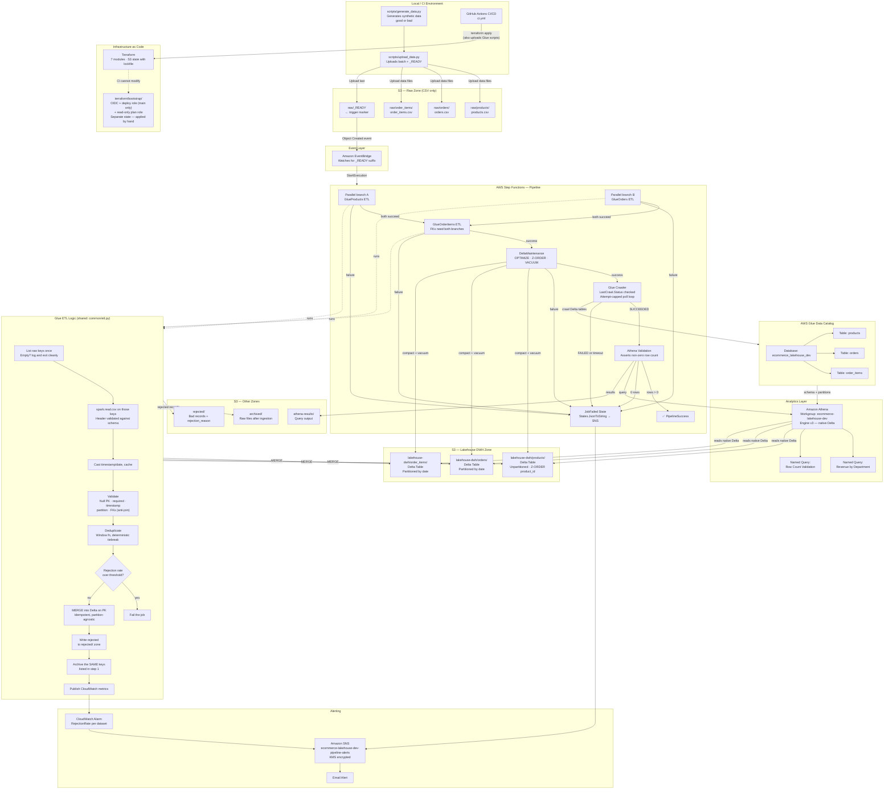
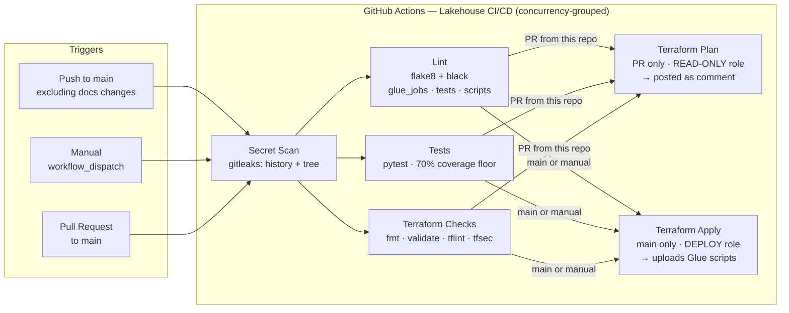
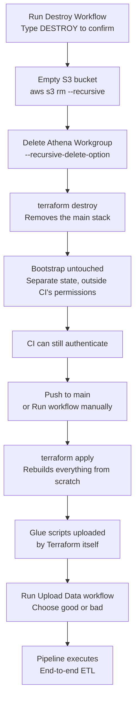
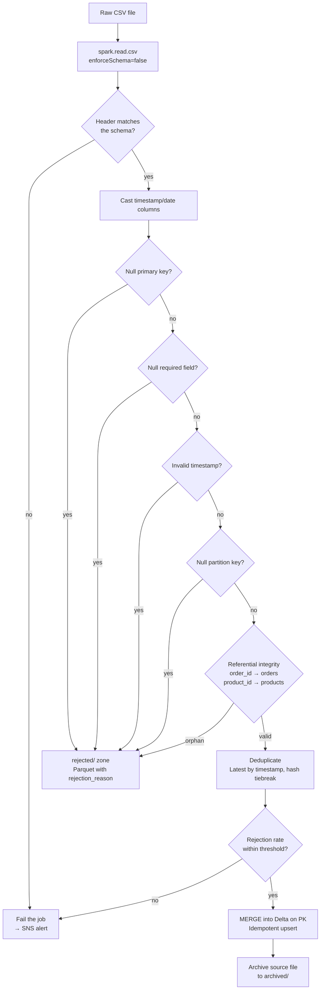
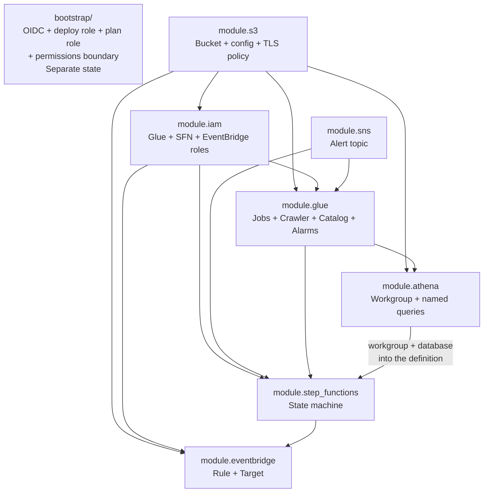

# Lakehouse Architecture Diagram

## Full System Architecture

---

## CI/CD Pipeline Flow

---

## Destroy & Rebuild Cycle

---

## Data Validation & Rejection Flow

---

## Terraform Module Dependencies

