# High-Level Architecture

```mermaid
flowchart TD
    classDef upload fill:#2d6a4f,color:#fff,stroke:#1b4332
    classDef trigger fill:#1d3557,color:#fff,stroke:#0d1b2a
    classDef orchestration fill:#6d2d92,color:#fff,stroke:#4a1a6b
    classDef processing fill:#c77dff,color:#000,stroke:#7b2d8b
    classDef storage fill:#e76f51,color:#fff,stroke:#ae4232
    classDef catalog fill:#457b9d,color:#fff,stroke:#1d3557
    classDef analytics fill:#2a9d8f,color:#fff,stroke:#1a6b62
    classDef alert fill:#e63946,color:#fff,stroke:#9b1c27
    classDef iac fill:#6c757d,color:#fff,stroke:#495057

    %% ── Upload ───────────────────────────────────────────────────────────────
    subgraph UPLOAD["① Data Ingestion"]
        direction LR
        GEN["Generate Data\nscripts/generate_data.py\nSynthetic good or bad records"]
        SCRIPT["Upload Script\nscripts/upload_data.py\n--type good | bad"]
        GEN --> SCRIPT
    end

    %% ── S3 Raw Zone ──────────────────────────────────────────────────────────
    subgraph RAW["② Amazon S3 — Raw Zone (CSV only)\ns3://ecommerce-lakehouse-dev-352505432441/raw/"]
        direction LR
        P["raw/products/\nproducts.csv"]
        O["raw/orders/\norders.csv"]
        OI["raw/order_items/\norder_items.csv"]
        RDY["raw/_READY\nUpload trigger marker"]
    end

    %% ── Event Trigger ────────────────────────────────────────────────────────
    subgraph EVENT["③ Amazon EventBridge"]
        RULE["Rule: ecommerce-lakehouse-dev-pipeline-ready\nPattern: Object Created + key suffix _READY\nTarget: Step Functions StartExecution"]
    end

    %% ── Orchestration ────────────────────────────────────────────────────────
    subgraph SFN["④ AWS Step Functions\nState Machine: ecommerce-lakehouse-dev-pipeline\nTimeoutSeconds 5400 · CloudWatch logs · X-Ray tracing"]
        direction TB
        S1["Parallel: GlueProducts\nstartJobRun.sync"]
        S2["Parallel: GlueOrders\nstartJobRun.sync"]
        S3["State: GlueOrderItems\nstartJobRun.sync"]
        S4["State: DeltaMaintenance\nstartJobRun.sync"]
        S5["State: RunGlueCrawler\nstartCrawler"]
        S6["Poll: WaitForCrawler → CheckCrawlerStatus\nChoice on LastCrawl.Status\nAttempt cap 40 × 30s"]
        S7["State: AthenaValidation\nstartQueryExecution.sync\n+ getQueryResults"]
        S7b["Choice: IsWarehousePopulated\nFails on 0 rows"]
        S8["State: PipelineSuccess\nSucceed"]
        SFAIL["State: JobFailed\nStates.JsonToString($.error)\nSNS Publish → FailState"]

        S1 & S2 --> S3 --> S4 --> S5 --> S6 --> S7 --> S7b --> S8
        S1 & S2 & S3 & S4 & S5 & S7 -->|Catch: States.ALL| SFAIL
        S6 -->|FAILED / CANCELLED / timeout| SFAIL
        S7b -->|0 rows| SFAIL
    end

    %% ── Glue ETL ─────────────────────────────────────────────────────────────
    subgraph GLUE["⑤ AWS Glue 4.0 — PySpark ETL\nDelta Lake · --datalake-formats delta · G.1X workers\nShared runner: common/etl.py"]
        direction LR
        subgraph JP["Job: ecommerce-lakehouse-dev-products\nReads CSV natively · Validates · Deduplicates · MERGE"]
            JP1["✓ Null product_id check\n✓ Null product_name check\n✓ Dedup on product_id\n✓ MERGE on PK into Delta\n✓ Archive the keys it listed"]
        end
        subgraph JO["Job: ecommerce-lakehouse-dev-orders\nReads CSV natively · Validates · Deduplicates · MERGE"]
            JO1["✓ Null order_id check\n✓ Null user_id check\n✓ Timestamp validation\n✓ Null partition check\n✓ Dedup on order_id\n✓ MERGE on PK into Delta"]
        end
        subgraph JOI["Job: ecommerce-lakehouse-dev-order-items\nReads CSV natively · Validates · Both FKs · MERGE"]
            JOI1["✓ Null id check\n✓ Null order_id / user_id\n✓ Timestamp validation\n✓ order_id → orders (anti-join)\n✓ product_id → products (anti-join)\n✓ Dedup on id · MERGE on PK"]
        end
        subgraph JM["Job: ecommerce-lakehouse-dev-maintenance\nCompacts the small files each load leaves behind"]
            JM1["OPTIMIZE + Z-ORDER\nproducts: product_id\norders / order_items: order_id\nVACUUM 168h"]
        end
    end

    %% ── S3 DWH Zone ──────────────────────────────────────────────────────────
    subgraph DWH["⑥ Amazon S3 — Lakehouse DWH Zone\ns3://.../lakehouse-dwh/\nDelta Lake · ACID"]
        direction LR
        DT1["lakehouse-dwh/products/\nDelta Table\nUnpartitioned · Z-ORDER product_id\n_delta_log/"]
        DT2["lakehouse-dwh/orders/\nDelta Table\nPartition: date\n_delta_log/"]
        DT3["lakehouse-dwh/order_items/\nDelta Table\nPartition: date\n_delta_log/"]
    end

    %% ── S3 Supporting Zones ───────────────────────────────────────────────────
    subgraph SUPPORT["Amazon S3 — Supporting Zones"]
        direction LR
        ARC["archived/\nRaw files post-ingestion\nLifecycle: → S3-IA 30d → Glacier 90d"]
        REJ["rejected/\nBad records as Parquet\nrejection_reason column\nExpires after 90 days"]
    end

    %% ── Glue Crawler ─────────────────────────────────────────────────────────
    subgraph CRAWLER["⑦ AWS Glue Crawler\necommerce-lakehouse-dev-crawler\ndelta_target · write_manifest = false"]
        direction LR
        CRAW["Registers native Delta tables\nDetects schema + partitions\nMerges new columns"]
    end

    %% ── Glue Data Catalog ────────────────────────────────────────────────────
    subgraph CATALOG["⑧ AWS Glue Data Catalog\nDatabase: ecommerce_lakehouse_dev"]
        direction LR
        CT1["Table: products\nunpartitioned"]
        CT2["Table: orders\ndate partition"]
        CT3["Table: order_items\ndate partition"]
    end

    %% ── Athena ───────────────────────────────────────────────────────────────
    subgraph ATHENA["⑨ Amazon Athena\nWorkgroup: ecommerce-lakehouse-dev\nEngine: Athena v3 · Results: s3://.../athena-results/"]
        direction LR
        AQ1["Validation Query\nTotal rows across all 3 tables"]
        AQ2["Named Query:\nRevenue by Department"]
        AQ3["Named Query:\nOrder Count by Date"]
        AQ4["Named Query:\nRow Count Validation"]
    end

    %% ── Alerting ─────────────────────────────────────────────────────────────
    subgraph ALERTING["⑩ Observability"]
        SNS["Amazon SNS (KMS encrypted)\nEmail on any pipeline failure"]
        METRICS["CloudWatch Lakehouse/ETL\nRowsIngested · RowsRejected · RejectionRate\nAlarm per dataset"]
        METRICS --> SNS
    end

    %% ── IAM ──────────────────────────────────────────────────────────────────
    subgraph IAM["IAM Roles"]
        direction LR
        GROLE["ecommerce-lakehouse-dev-glue-role\nAWSGlueServiceRole + S3 + Catalog + metrics"]
        SROLE["ecommerce-lakehouse-dev-sfn-role\nGlue + SNS + Athena + S3 + CloudWatch"]
        EROLE["ecommerce-lakehouse-dev-eventbridge-role\nstates:StartExecution"]
        GHROLE["ecommerce-lakehouse-github-actions-deploy\nOIDC · main branch only · least privilege\n+ permissions boundary"]
        GHPLAN["ecommerce-lakehouse-github-actions-plan\nOIDC · pull requests · ReadOnlyAccess"]
    end

    %% ── CI/CD ────────────────────────────────────────────────────────────────
    subgraph CICD["GitHub Actions CI/CD"]
        direction LR
        CIPUSH["Push to main\nor workflow_dispatch"]
        CISCAN["gitleaks\nhistory + working tree"]
        CILINT["Lint + Test\nflake8 · black · pytest 70%"]
        CITFCHK["fmt · validate · tflint · tfsec"]
        CITF["terraform apply\nAll 7 modules + Glue scripts"]
        CIPUSH --> CISCAN --> CILINT --> CITFCHK --> CITF
    end

    %% ── Connections ──────────────────────────────────────────────────────────
    SCRIPT -->|"1. Upload CSV files"| P & O & OI
    SCRIPT -->|"2. Upload last"| RDY
    RDY -->|"S3 Object Created event"| RULE
    RULE -->|"StartExecution\n{trigger: {bucket, key}}"| SFN

    S1 -->|"runs"| JP
    S2 -->|"runs"| JO
    S3 -->|"runs"| JOI
    S4 -->|"runs"| JM

    JP -->|"MERGE"| DT1
    JO -->|"MERGE"| DT2
    JOI -->|"MERGE"| DT3

    JP & JO & JOI -->|"archive"| ARC
    JP & JO & JOI -->|"rejected rows"| REJ
    JP & JO & JOI -->|"row counts"| METRICS

    JM -->|"compact + vacuum"| DT1 & DT2 & DT3
    S5 -->|"crawl"| CRAWLER
    CRAWLER -->|"register schema + partitions"| CATALOG
    CATALOG -->|"table metadata"| ATHENA
    ATHENA -->|"reads native Delta"| DT1 & DT2 & DT3

    SFAIL -->|"Publish message"| SNS

    CICD -->|"provisions"| IAM
    GROLE -.->|"used by"| GLUE
    SROLE -.->|"used by"| SFN
    EROLE -.->|"used by"| RULE

    %% ── Styles ───────────────────────────────────────────────────────────────
    class UPLOAD,GEN,SCRIPT upload
    class RAW,P,O,OI,RDY,DWH,DT1,DT2,DT3,ARC,REJ,SUPPORT storage
    class EVENT,RULE trigger
    class SFN,S1,S2,S3,S4,S5,S6,S7,S7b,S8,SFAIL orchestration
    class GLUE,JP,JO,JOI,JM,JP1,JO1,JOI1,JM1 processing
    class CATALOG,CT1,CT2,CT3,CRAWLER,CRAW catalog
    class ATHENA,AQ1,AQ2,AQ3,AQ4 analytics
    class ALERTING,SNS,METRICS alert
    class CICD,CIPUSH,CISCAN,CILINT,CITFCHK,CITF,IAM,GROLE,SROLE,EROLE,GHROLE,GHPLAN iac
```

---

## Flow Summary

| Step | AWS Service | What Happens |
|---|---|---|
| ① | Local scripts | Synthetic data generated as CSV, uploaded to the S3 raw zone |
| ② | Amazon S3 | `raw/_READY` uploaded as the final trigger signal |
| ③ | Amazon EventBridge | Detects `_READY` → fires exactly one Step Functions execution |
| ④ | AWS Step Functions | Products ∥ Orders → Order Items → maintenance → crawler → validation, with retries, catches and timeouts |
| ⑤ | AWS Glue + PySpark | Reads CSV across executors, validates, deduplicates, merges into Delta |
| ⑥ | Amazon S3 + Delta Lake | ACID Delta tables; facts partitioned by date, the dimension Z-ORDERed |
| ⑦ | AWS Glue Crawler | Registers native Delta tables; the pipeline checks the crawl actually succeeded |
| ⑧ | AWS Glue Data Catalog | Metadata store — tables visible to Athena |
| ⑨ | Amazon Athena | SQL analytics on native Delta tables (engine v3, no manifests) |
| ⑩ | SNS + CloudWatch | Email on failure; row-count and rejection-rate metrics with an alarm |
